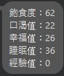
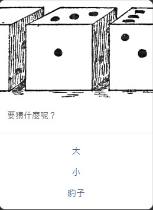
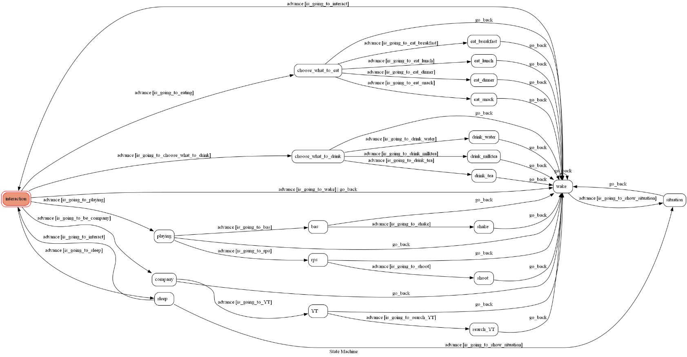

# Line company

## 前言
在冷冷的天氣裡是否少了點溫暖，在吃飯時是不是少了一點陪伴，因此想設計一個可以陪伴使用者的linechatbot，在吃飯的時候一起吃飯看影片，在睡覺時可以一起睡覺，甚至是無聊時可以玩點遊戲，根據古早味電玩-電子雞的基礎，這款linechatbot便誕生出來

## 構想
根據電子雞的基礎先給予基礎的各項值，並會根據互動的種類在各項值產生變化，也會有不同的回覆。還需要有遊戲的功能讓使用者無聊時殺時間用。另外還需要能推薦影片的功能讓使用者在吃飯或是無聊時可以看點影片度過時間，讓使用者有人一起看影片的感覺

## 環境
Windows 10 64its
python 3.11.1

## 技術
-selenium
    -用來進行youtube爬蟲

##使用教學
1.pip install -r requirement.txt
```sh
pip install -r requirement.txt
```

若graphviz或pygraphviz安裝失敗則先去graphviz下載graphviz執行檔並執行 
接著到終端機執行以下指令
```sh
pip install --global-option=build_ext --global-option="-IC:\Program Files\Graphviz\include" --global-option="-LC:\Program Files\Graphviz\lib" pygraphviz
```

接著重新安裝pygraphviz即可

3. 從`.env.sample`產生出一個`.env`，並填入以下四個資訊

- Line
    - LINE_CHANNEL_SECRET
    - LINE_CHANNEL_ACCESS_TOKEN
- Olami
    - APP_KEY
    - APP_SECRET

2.安裝ngrok
到ngrok的網站註冊帳戶並下載安裝檔執行
接著在ngrok的終端機上執行
ngrok config add-authtoken +你的token
```sh
ngrok config add-authtoken
```

3.執行ngrok
```sh
ngrok http 8080
```

4.執行程式
```sh
python app.py
```

## 使用說明
- 基本操作
    - 幾乎所有的操作都只要按template上的按鍵即可執行
    - 在開始時只需要輸入隨便一段文字即可開啟對話
    - 只要輸入的文字不符合皆會跳回到初始階段

- 流程
    - 剛開始在頁面中跟她打招呼就會顯示
    ###顯示招呼介面
    <p align=center>
        
    </p>
    
    - 按下顯示狀態後就會顯示
    <p align=center>
        
    </p>
    
    - 按下互動會顯示
    <p align=center>
        
    </p>
    
    接著便可以選擇要做什麼互動
    - 按下"吃東西"會跳到要吃哪一餐的介面，可以選擇現在是吃哪一餐
    <p align=center>
        
    </p>
    
    - 按下任意一餐後會跳出linebot想吃什麼東西，並會增加飽食度，可以提供使用者餐點的參考
    <p align=center>
        
    </p>
    
    - 按下"喝東西"會跳出選擇要喝甚麼的介面，按下後會跳出Linebot對於這個選擇的想法，選擇不同的飲料會對linebot的飲水度跟幸福度產生不同的影響
    <p align=center>
        
    </p>
    
    - 在按"下去睡覺"的按鈕後會看到linebot進入睡覺模式，下面會有可以叫Linebot起床的按鈕
    <p align=center>
        
    </p>
    
    - 在按下"玩遊戲吧"的按鈕會跳出要玩哪一種遊戲的按鈕，目前有猜拳跟猜大小兩種遊戲
    <p align=center>
        
    </p>
    
    - 按下猜拳後會跳出選擇要出什麼拳的介面
    <p align=center>
        
    </p>
    
    - 按下一種後Linebot會隨機出一種拳並告訴結果，結果會影響linebot的幸福值
    <p align=center>
        
    </p>
    
    - 按下猜大小後會跳出要猜大、猜小、猜豹子三種選項
    <p align=center>
        
    </p>
    
    - 按下任一選項後linebot會告訴結果並影響linebot的幸福值
    <p align=center>
        
    </p>
    
    - 按下找點樂子的按鈕後會跳出看youtube的介面
    <p align=center>
        
    </p>
    
    - 按下youtube按鍵後linebot會詢問要看什麼
    <p align=center>
        
    </p>
    
    - 輸入想看什麼東西後等待幾秒讓linebot去找尋資料，最後會顯示查詢結果的前十筆資料
    <p align=center>
        
    </p>

## fsm-chart
<p align=center>
    
</p>